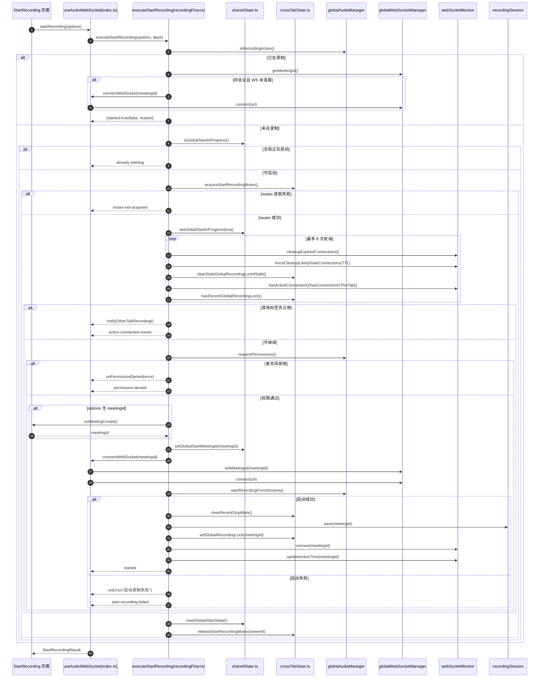
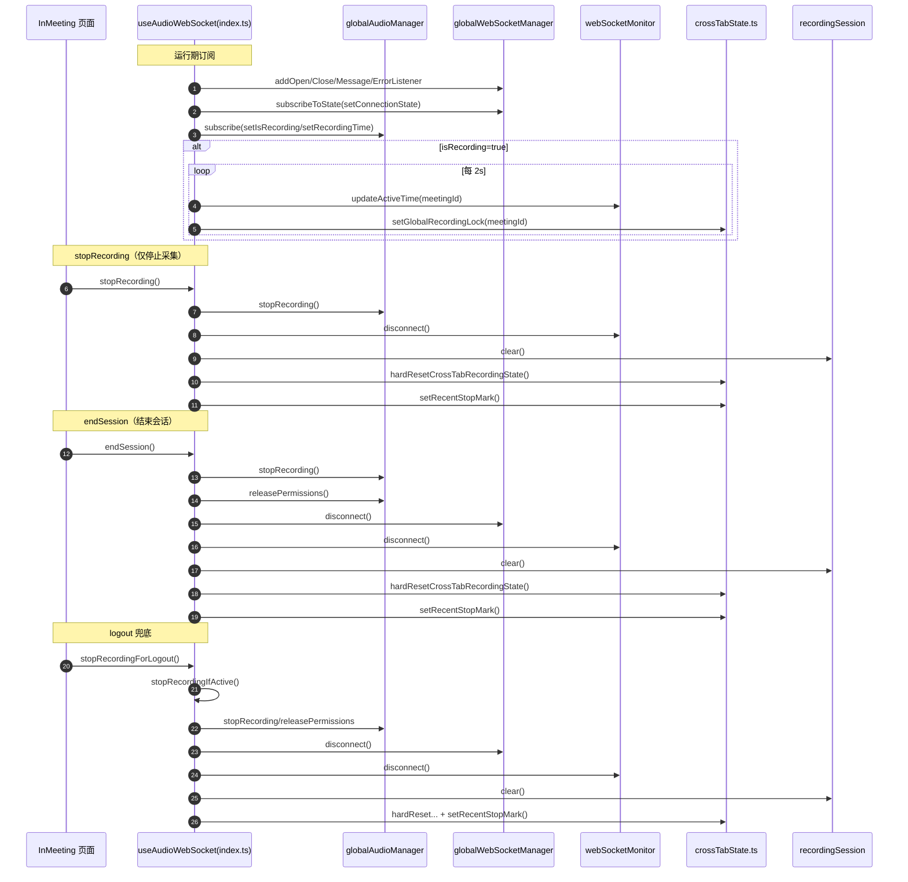
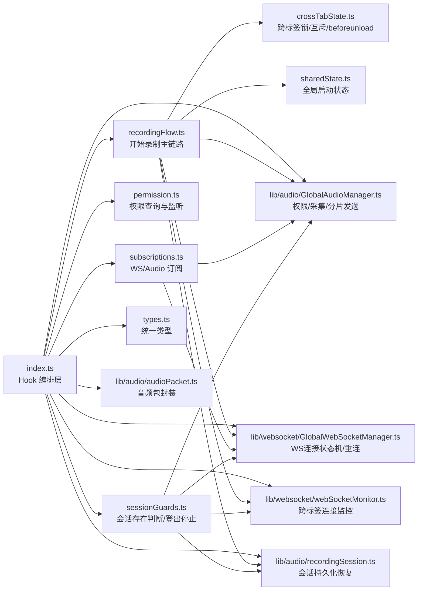
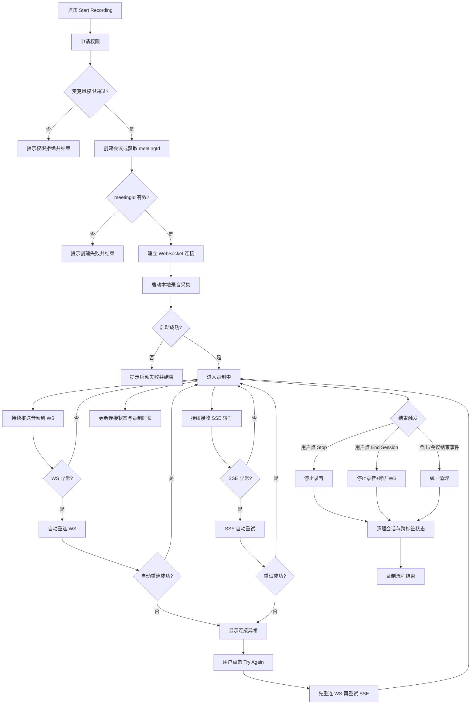

# Audio WebSocket Flow

## 启动录制时序

### 启动链路方法注释

- `startRecording(options)`：对外入口，触发完整的“检查 -> 权限 -> 建连 -> 开录”流程。
- `executeStartRecording(options, deps)`：启动主流程实现，统一处理成功/失败分支与清理逻辑。
- `isGlobalStartInProgress()`：检查是否已有标签页正在执行启动流程，避免并发启动。
- `acquireStartRecordingMutex()`：跨标签抢占启动互斥锁，防止重复弹权限。
- `requestPermissions()`：申请麦克风/屏幕权限，失败时直接中断流程。
- `onMeetingCreate()`：在无 `meetingId` 场景下由业务侧创建会议并返回 ID。
- `connectWebSocket(meetingId)`：设置会话 `meetingId` 并连接音频 WebSocket。
- `startRecordingFromStreams()`：在权限流就绪后开始音频采集与切片发送。
- `setGlobalRecordingLock(meetingId)`：写入跨标签“正在录制”标记，避免其他页误启动。
- `resetGlobalStartState()`：在 `finally` 中重置全局启动状态，确保下次可重试。

## 运行期与停止时序

### 运行期/停止链路方法注释

- `addOpen/Close/Message/ErrorListener`：绑定 WebSocket 生命周期事件，回传连接状态和消息。
- `subscribeToState(setConnectionState)`：订阅底层连接状态机，驱动 Hook 的 `isConnected/isConnecting`。
- `subscribe(setIsRecording/setRecordingTime)`：订阅录制状态与时长，驱动 UI 展示。
- `updateActiveTime(meetingId)`：周期更新活跃时间，防止监控记录被误清理。
- `stopRecording()`：只停采集，不强制断网，适合暂停场景。
- `endSession()`：结束会话，执行“停采集 + 释放权限 + 断网 + 清状态”全清理。
- `stopRecordingForLogout()`：登出兜底入口，内部复用 `stopRecordingIfActive()`。
- `hardResetCrossTabRecordingState()`：清理跨标签残留锁与监控状态，避免“幽灵占用”。
- `setRecentStopMark()`：打最近停止标记，协助下次启动阶段自愈判定。

## 模块职责图

### 跨模块关键方法注释

- `hasOngoingRecordingSession()`：统一判断“当前是否存在活跃录制会话”。
- `stopRecordingIfActive()`：统一执行会话级停止与资源回收（常用于登出/兜底）。
- `createMicrophonePermissionChecker()`：构造权限查询函数，封装权限 API 与 fallback。
- `cleanupPermissionStatusListener()`：移除权限状态监听，避免组件卸载后的更新。
- `bindWebSocketSubscriptions()`：集中绑定/解绑 WebSocket 事件与状态订阅。
- `bindAudioManagerSubscription()`：集中绑定/解绑音频状态订阅与回调触发。

## 业务视角简化图

